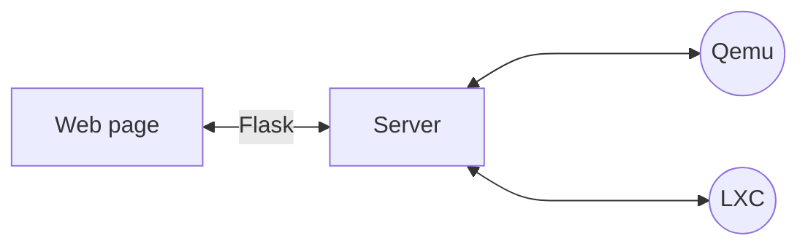

# Hype²


## Quick Start

**1 - Create a bridge interface**

On your host, create the bridge interface **br0**, according to your network with :

- **int** The physical interface (example : enp1s0)
- **ip** your fixed IP 
- **netmask** your netmask (example: 255.255.255.0)
- **gateway** your gateway
```sh
auto br0
iface br0 inet static
bridge_ports <int>
bridge_fd 0
bridge_maxwait 0
address <ip>
netmask <netmask>
gateway <gateway>
```
**2 - Install git and clone the repo**

```sh
apt install git
git clone https://github.com/pyhype2/Hype2.git
```

**3 - Start the install script**

```sh
cd Hype2
sh ./install.sh
```


## Manual installation

### Install requirements
For your safety you can also find the packages on pip or pipx and the requirement.txt file.

**1 - Update and Install packages :**

```sh
apt-get update -y -qq
apt-get install git lxc lxcfs lxc-templates qemu qemu-utils qemu-kvm virtinst bridge-utils virt-manager libvirt-daemon libvirt-daemon-system virt-viewer libvirt-clients libosinfo-bin websockify sqlite3 novnc
apt-get install python3 python3-flask python3-flask-login python3-flask-sqlalchemy python3-requests python3-lxc python3-libvirt python3-psutil python3-werkzeug python3-websockify python3-novnc python3-flask-socketio python3-openssl
apt-get install openvswitch-switch openvswitch-common

```

Clone the repository :

```sh
git clone https://github.com/pyhype2/Hype2.git
cd Hype2
```

**2 - Configure Libvirt to start on boot**

```sh
systemctl --quiet enable --now libvirtd
systemctl --quiet  start libvirtd
```

**3 - Create a bridge network**

This bridge will allow you to connect your Virtual Servers and Containers to your local network in order to access them easily.

```sh
cp ./bridged.xml /usr/share/libvirt/networks/
virsh net-define bridged.xml
virsh net-start bridged
virsh net-autostart bridged
```

On your host, create the bridge interface "br0", according to your network with :
- **int** The physical interface (example : enp1s0)
- **ip** your fixed IP
- **netmask** your netmask (example: 255.255.255.0)
- **gateway** your gateway
```sh
auto br0
iface br0 inet static
bridge_ports <int>
bridge_fd 0
bridge_maxwait 0
address <ip>
netmask <netmask>
gateway <gateway>
```
**4 - Modify Qemu configuration**

You will have to uncomment these lines :

```sh
vnc_listen = "0.0.0.0"
user=root
group=root
```

This will ajust rights for Qemu to run as root and enable VNC on all address for the console.

### Database for users

A default Database is provided in the git (install/db.db.admin_example), the default user is admin@admin.com / admin.
To use this database, just change the name from db.db.admin_example to db.db

Once connected, you will be able to create/manage users directly on software.

```sh
cp db.db.admin_example db.db
```
For security reason, you should remove **db.db.admin_example** 

If you want to create this database by yourself, you can :

### Create Database for users (Manual creation)

```sh
sqlite3 db.db

CREATE TABLE user (id INTEGER PRIMARY KEY AUTOINCREMENT, username NVARCHAR(200) NULL, email NVARCHAR(200) NULL, password NVARCHAR(200) NULL);
```

### Create first user

**1 - Generate encrypted password :**

```sh
python3
import app
app.encrypt('Password')

```
**2 - Fill Database with user info :**

```sh
sqlite3 db.db

INSERT INTO user (id,username,email,password) VALUES (1,'<you_username>','<your_email>','<your_previous_encrypted_password');
```

### Configure Reverse Proxy to get access to Consoles

In order to access to the consoles which are running websockets on other ports (6080 vor VNC and 5008 for Pyxterm),
a Reverse proxy is needed.

Whitout this, you can still access to consoles using CLI for Serial access :

```sh
lxc-attach <container>
```

and using a tool such as :

https://www.realvnc.com/en/connect/download/viewer/

For VNC access (on port 6080).

To set your Reverse proxy, you can use the examples bellow (adapt to your case of course).

Example for nginx:
```sh
server {
    listen 443 ssl;
    server_name www.example.com;

    ssl_certificate /path/to/your/cert.pem;
    ssl_certificate_key /path/to/your/privkey.pem;
    ssl_verify_client off;
    ssl_protocols TLSv1.2 TLSv1.3;
    ssl_ciphers 'TLS_AES_128_GCM_SHA256:TLS_AES_256_GCM_SHA384:TLS_CHACHA20_POLY1305_SHA256:ECDHE-RSA-AES128-GCM-SHA256:ECDHE-RSA-AES256-GCM-SHA384';

    location /websockify {
        proxy_pass http://<your_ip>:6080/websockify;
        proxy_http_version 1.1;
        proxy_set_header Upgrade $http_upgrade;
        proxy_set_header Connection "upgrade";
    }

    location /socket.io {
        proxy_pass http://<your_ip>:5008/socket.io;
        proxy_http_version 1.1;
        proxy_set_header Upgrade $http_upgrade;
        proxy_set_header Connection "upgrade";
    }

    location / {
        proxy_pass https://<your_ip>:5007/;
        proxy_set_header X-Forwarded-Proto https;
        proxy_set_header Host $host;
        proxy_set_header X-Real-IP $remote_addr;
    }
}
```

Example for apache2 configuration :
```sh
<VirtualHost *:443>
ServerName www.example.com
RewriteEngine on
SSLEngine On
SSLCertificateFile /path/to/your/cert.pem
SSLCertificateKeyFile /path/to/your/privkey.pem
SSLProxyVerify none
SSLProxyCheckPeerCN off
SSLProxyEngine          On
SSLProxyCheckPeerExpire off
ProxyRequests     Off
ProxyPreserveHost On
RequestHeader set X-Forwarded-Proto "https"
ProxyPass /websockify ws://<your_ip>:6080/websockify retry=3
ProxyPassReverse /websockify ws://<your_ip>:6080/websockify retry=3
ProxyPass /socket.io ws://<your_ip>:5008/socket.io retry=3
ProxyPassReverse /socket.io ws://<your_ip>:5008/socket.io retry=3
ProxyPass         / https://<your_ip>:5007/
ProxyPassReverse  / https://<your_ip>:5007/
</VirtualHost>
```

## Run and use
```sh
python3 app.py
```
and go to https://<server_ip> (or https://<server_ip>:5007 without RP) with your credentials (mail and normal password or admin)

NB: The first LXC creation will take time to download files. Be patient 

### Systemd

You can manage hype using Systemd management by creating a file *hype2.service* :

```sh
[Unit]
Description= Hype2 service
After=multi-user.target
[Service]
Type=simple
Restart=always
ExecStart=/usr/bin/python3 <path_to_Hype2>/app.py
[Install]
WantedBy=multi-user.target

```

Move or copy this file in */etc/systemd/system/* and you can then enable/disable it from boot start, and/or start/stop the app.

```sh
systemctl enable hype2.service
systemctl start hype2.service
```
## Configuration

You can also change some configuration in the file **configuration.py** such as flask port, storage location...use it at your own risk.


## Windows requirement (Virtuio)
If you plan to install some Windows Virtual Machine, you will need to download the Virtuo (Windows drivers IO) and place the ISO in the *<hype_path>/storage/win* folder.

https://fedorapeople.org/groups/virt/virtio-win/direct-downloads/archive-virtio/virtio-win-0.1.229-1/


You will also need to configure the ISO name in the *configuration.py* file.

```sh
virtuo_file='virtio-win-0.1.229.iso'
```

*NB: Depending on the Windows version you need, you will need to use a specific Virtio version. Lastest version will remove the old Windows version driver.*


## Others

You can upload ISO directly from the interface. 
If you desire to use another way such as scp or else, you can place the iso in the *<hype_path>/storage/iso/* folder


## Disclamer

This software is in dev and no support or commercial use are allowed.
Please do not use it for production use or assume it.

For security reason, do not open access from internet.

Enjoy ;)
